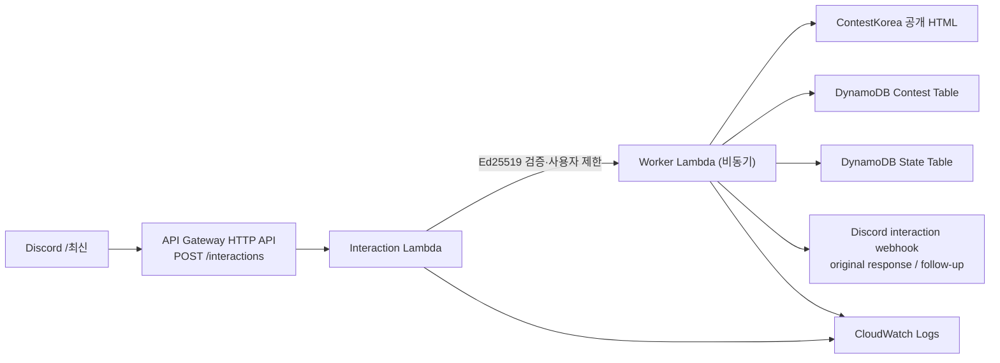

# 아키텍처

## 요청 흐름

## 컴포넌트 책임

- API Gateway HTTP API는 Discord Interactions Endpoint에 공개하는 POST `/interactions` 단일 route다.
- Interaction Lambda는 Discord의 `X-Signature-Ed25519`와 `X-Signature-Timestamp`를 Ed25519로 검증한다. PING은 즉시 PONG으로 처리하고, `/최신`은 허용 사용자만 Worker Lambda에 `InvocationType=Event`로 전달한 뒤 ephemeral deferred response를 반환한다.
- Worker Lambda는 요청 시에만 ContestKorea를 순차 수집한다. EventBridge, queue, 상시 실행 프로세스는 사용하지 않는다.
- Contest Table은 `contest_id`로 이미 관측한 공모전을 보관한다. `contestkorea:{str_no}`가 기본 키다.
- State Table은 `discord_user_id`별 최초 기준선 및 마지막 조회 시각을 보관한다.
- Worker는 첫 요청에는 현재 대상 목록을 기준 데이터로 저장하고, 이후 요청에는 한 번도 보지 못한 `contest_id`만 Discord에 보낸다.

## 보안 경계

- Discord public key는 Lambda 환경변수로 주입하고 요청 body, timestamp, signature을 함께 검증한다.
- `ALLOWED_DISCORD_USER_ID`와 일치하지 않는 요청은 Worker 호출 없이 ephemeral 접근 거부를 반환한다.
- Discord interaction token은 Worker event에서만 사용하며 로그에는 기록하지 않는다.
- Discord bot token은 명령 등록 스크립트에서만 사용한다. Lambda 런타임에는 필요하지 않다.
- IAM 역할은 Interaction Lambda의 Worker invoke 권한, Worker Lambda의 두 DynamoDB table read/write 권한, 각 함수의 해당 CloudWatch log group write 권한으로 나눴다.

## 수집 경계

- `int_gbn=1`만 요청하므로 대회·공모전만 포함하고 대외활동(`int_gbn=2`)은 제외한다.
- 목록의 상태 text가 정확히 `접수중` 또는 `접수예정`인 항목만 상세 요청한다.
- 목록의 `str_no`는 상세 URL에서도 확인되는 안정적 식별자이므로 제목이 아니라 `contestkorea:{str_no}`를 동일성 판단에 사용한다.
